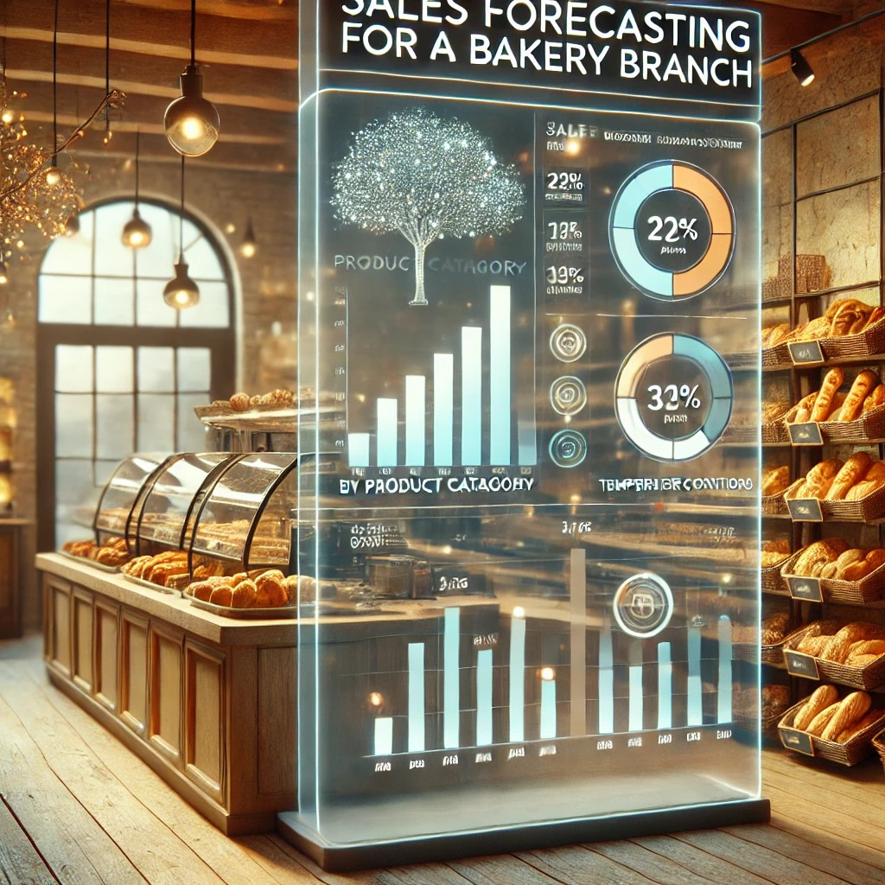

# Sales Forecasting for a Bakery Branch

## Repository Link

[https://github.com/vitalisor/bakery_sales_prediction]

## Description

This project aims to develop and evaluate machine learning models for predicting sales figures in a bakery. By utilizing historical sales data from July 1, 2013, to July 30, 2018, the objective is to inform inventory and staffing decisions. The project focuses on six product categories: Bread, Rolls, Croissants, Confectionery, Cakes, and Seasonal Bread. A baseline linear regression model was first implemented to identify fundamental trends, followed by a sophisticated neural network to capture more complex patterns and enhance forecast accuracy. The predictions from the neural network were then compared with actual sales figures. The initiative included meticulous data preparation, feature engineering, integration of external variables (e.g., weather data, local events, holidays), and model fine-tuning. The final models were evaluated using Mean Absolute Percentage Error (MAPE) and other key performance metrics.

### Task Type

Regression, neural network

### Results Summary

-   **Best Model:** [neural network]
-   **Evaluation Metric:** MAPE
-   **Result by Category** (Identifier):
    -   **Bread** (1): [22.70]%
    -   **Rolls** (2): [16.07]%
    -   **Croissant** (3): [18.79]%
    -   **Confectionery** (4): [21.63]%
    -   **Cake** (5): [8.02]%
    -   **Seasonal Bread** (6): [52.63]%
 
## Documentation

1.  [**Data Import and Preparation**](0_DataPreparation/)
3.  [**Dataset Characteristics**](1_DatasetCharacteristics/)
4.  [**Baseline Model**](2_BaselineModel/)
5.  [**Model Definition and Evaluation**](3_Model/)
6.  [**Presentation**](4_Presentation/README.md)

## Cover Image

